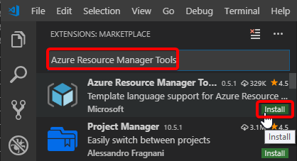
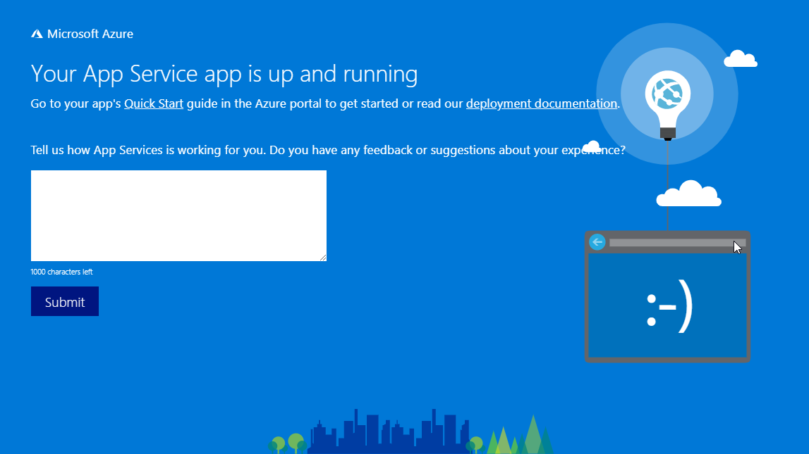

# Using Azure Resource Manager Templates to supercharge your Azure Deployments

Whether you’re a Developer building applications or an IT Pro building virtual data centres in
Azure, at some point you're going to want to use modern Configuration Management practices to
build those services. Azure Resource Manager Templates are the powerful declarative Infrastructure
as Code system that is baked in to Azure. In this session we'll take a look at what Azure Resource
Manager templates are, how to create and edit them and what tricks, tips and tools are available
to you to help you become a Configuration Management master in Azure.

_This workshop was originally created for the Global Azure Bootcamp 2019, but it may be used for
other training sessions or events. It is provided free and under [MIT license](LICENSE)._

**Daniel Scott-Raynsford**


[Microsoft Cloud and Datacenter MVP](https://mvp.microsoft.com/en-us/PublicProfile/5002340?fullName=Daniel%20%20Scott-Raynsford) | [@dscottraynsford](https://twitter.com/dscottraynsford) | [Linked-In](https://www.linkedin.com/in/dscottraynsford/) | [Email](mailto:dscottraynsford@outlook.com) | [GitHub](https://www.github.com/PlagueHO)

## Content

- [Prerequisite Knowledge](#prerequisite-knowledge)
- [What You Will Need](#what-you-will-need)
- [What You Will Learn](#what-you-will-learn)
- [Prerequisite Knowledge](#prerequisite-knowledge)
- [Workshop Scenario](#workshop-scenario)
- [Section 1 - Getting Setup](#section-1---getting-setup)
- [Part 1.1 - Setting up Cloud Shell](#part-11---setting-up-cloud-shell) - 5 min
- [Part 1.2 - Configure Visual Studio Code](#part-12---configure-visual-studio-code) - 5 min
- [Part 1.3 - Register Providers required for Lab](#part-13---register-providers-required-for-lab) - 5 min
- [Section 2 - Creating an ARM Template](#section-2---creating-an-arm-template)
- [Part 2.1 - Create Resources in the Portal](#part-21---create-resources-in-the-portal) - 7 min
- [Part 2.2 - Export an ARM Template](#part-22---export-an-arm-template) - 3 min
- [Part 2.3 - Edit an Exported ARM Template](#part-23---edit-an-exported-arm-template) - 15 min
- [Section 3 - Deploying an ARM Template](#section-3---deploying-an-arm-template)
- [Part 3.1 - Visualize the ARM Template](#part-31---visualize-the-arm-template) - 1 min
- [Part 3.2 - Deploy the ARM Template using the Portal](#part-32---deploy-the-arm-template-using-the-portal) - 5 min
- [Part 3.3 - Re-deploy a Template Deployment](#part-33---re-deploy-a-template-deployment) - 3 min
- [Part 3.4 - Deploy the ARM Template using Cloud Shell](#part-34---deploy-the-arm-template-using-cloud-shell) - 3 min
- [Part 3.5 - Deploy the ARM Template with Parameters File using Cloud Shell](#part-35---deploy-the-arm-template-with-parameters-file-using-cloud-shell) - 3 min
- [Challenge 3.6 - Deploy from Storage Account](#challenge-36---deploy-from-storage-account) - 10 min
- [Section 4 - Important Techniques and Functions](#section-4---important-techniques-and-functions)
- [Part 4.1 - Special Resources](#part-41---special-resources) - 10 min
- [Part 4.2 - Define Resource Dependencies](#part-42---define-resource-dependencies) - 7 min
- [Part 4.3 - Modularize Templates](#part-43---modularize-templates)
- [Part 4.3.1 - Nested Templates](#part-431---nested-templates) - 5 min
- [Part 4.3.2 - Linked Templates](#part-432---linked-templates) - 5 min
- [Part 4.4 - Manage Secrets](#part-44---manage-secrets)
- [Part 4.4.1 - Deploy Azure Key Vault using ARM Template](#part-441---deploy-azure-key-vault-using-arm-template) - 5 min
- [Part 4.4.2 - Deploy a SQL Server with a Static ID](#part-442---deploy-a-sql-server-with-a-static-id) - 10 min
- [Challenge 4.4.3 - Deploy a SQL Server with a Dynamic ID](#challenge-443---deploy-a-sql-server-with-a-dynamic-id) - 20 min
- [Part 4.5 - Create Multiple Instances](#part-45---create-multiple-instances) - 5 min
- [Section 5 - Cleanup After the Workshop](#section-5---cleanup-after-the-workshop)
- [Part 5.1 - Remove Resources and Resource Groups](#part-51---remove-resources-and-resource-groups) - 2 min

Estimated workshop time: 75 min
Estimated Azure credit usage: USD 1.00 (as long as you delete the infrastructure straight after completion of the workshop)

## What You Will Need

To complete this workshop you'll need the following:

- A **Microsoft Azure Account**:
  - If you are running this as part of the Global Azure Bootcamp, you will
    have access to a free Azure Pass.
  - You can sign up for a free trial [here](https://azure.microsoft.com/en-us/free/).
- A computer running **Windows**, **OSX** or **Linux** (desktop OS) with
  an **up-to-date version** of either Chrome, Firefox, Edge or Opera.
- **Visual Studio Code**: An extremely powerfull, free open-source editor
  for Windows, Mac and Linux.
  Click [here](https://code.visualstudio.com/) to download it.

## Prerequisite Knowledge

- Basic knowledge of web application hosting on Windows or Linux.
- Basic knowledge of text editors (Visual Studio Code).
- Basic knowledge of using text based consoles (PowerShell, Cmd or Bash).

## What You Will Learn

You'll learn the basics in the following skills:

- Create and use the Azure Cloud Shell.
- How to set up Visual Studio Code to edit ARM templates.
- Run some simple PowerShell commands in Cloud Shell.
- What an Azure Resource Manager (ARM) template is and what it is used for.
- How to create basic ARM templates
- How to deploy ARM templates
- How to use Visual Studio Code to edit ARM templates.

## Workshop Scenario

In this workshop in Section 1-3, we want to create three almost identical environments for
hosting Web Apps: _Dev_, _Test_ and _Prod_.

Each environment will be in its own Resource Group and will contain:

- App Service Plan - for running the App Service
- App Service - for hosting the Web App
- Application Insights - for monitoring the Web App

The environments will be identical except for the resource names and the
_Prod_ environment will be an `S2` plan instead of an `S1`.

We will create the first Dev environment using the Azure Portal and use this
to export an ARM template.

We will then customize the ARM template by cleaning it up and adding parameters.

Once the ARM template has been customized, we will use it to deploy the
_Test_ and _Prod_ environments.


## Challenges

Throughout this workshop are **Challenges**.
These are additional tasks that you can undertake to increase your learning.
These challenges will appear like this:

> Challenge x.x.x: Do something or other.

Section 4 of this workshop contains advanced techniques that do not
relate to this workshop scenario, but could be used with it.
It contains multiple challenges for you to complete.

If you get stuck with a challenge, you can find an example solution in the [/src/challengesolutions/ folder](/src/challengesolutions/).

## Presentation

The presentation pack to go along with this workshop can be found [here](/ppt/using-azure-resource-manager-templates-to-supercharge-your-azure-deployments).

## Section 1 - Getting Setup

In this section we'll set up _Azure Cloud Shell_ and _Visual Studio Code_,
so that we're all set to create and deploy ARM templates right from our
desktop.

### Part 1.1 - Setting up Cloud Shell

> Estimated Completion Time: 5 min

Azure Cloud Shell is an interactive, browser-accessible shell for managing
Azure resources. It provides the flexibility of choosing the shell experience
that best suits the way you work. Cloud Shell offers both PowerShell and Bash
console experience and you can flip between them at the touch of a switch.

_Sidenote: the PowerShell experience is actually PowerShell Core running on top
of Bash in a Linux container!_

**In this lab we'll be using the PowerShell experience using the Az PowerShell
modules, but if you're experienced using Bash and the AzCLI, then feel free
to flick across.**

1. Open Cloud Shell by clicking the Cloud Shell icon:
   

> If you have **not** previously used Azure Cloud Shell:

_When you first create a Cloud Shell a storage account will get created
for you to store your settings, scripts and other files you might create.
This enables you to have access to your own environment no matter what
device you're using.
You can customize the storage account settings if you wish, but in this
lab we'll just be using the defaults._


1. Select the **subscription** to create the Storage Account in and click
   **Create storage**.

1. The Storage Account will be created and the Cloud Shell will be started:

   

> Once your Azure Cloud Shell storage has been set up or if you had previous set up Azure Cloud Shell:

1. Select **PowerShell** from the shell drop down:

   

### Part 1.2 - Configure Visual Studio Code

> Estimated Completion Time: 5 min

In this part we will configure Visual Studio Code with the following
extensions:

- [Azure Account](https://marketplace.visualstudio.com/items?itemName=ms-vscode.azure-account):
  The Azure Account extension provides a single Azure sign-in and subscription filtering experience for all other Azure extensions. It makes Azure's Cloud Shell service available in VS Code's integrated terminal.
- [Azure Resource Manager Tools](https://marketplace.visualstudio.com/items?itemName=msazurermtools.azurerm-vscode-tools):
  This extension provides language support for Azure Resource Manager deployment templates and template language expressions.

We will then be configuring Visual Studio Code to be able to connect
to our Azure Cloud Shell.

1. Start Visual Studio Code.
1. Click Extensions.

   

1. Search for the `Azure Account` extension and click **Install**.

   

1. Search for the `Azure Resource Manager Tools` extension and click `Install`.

   

1. Press <kbd>F1</kbd> to bring up the Visual Studio command search.
1. Enter `Cloud Shell` in the command search.
1. Click the **Azure: Open PowerShell in Cloud Shell** command.

   

1. A terminal will open in the Visual Studio Code window requiring you
   to log in to Azure.

   

1. Click Sign In.
1. A browser window will open where you will be asked to sign into your
   Azure account.
1. Sign into the Azure account you created the Cloud Shell in during
   _Step 1.1_.
1. Return to your Visual Studio Code window where you will now have a
   Cloud Shell console ready to accept commands:

   

This console is exactly the same as the Cloud Shell you get in the
[Azure Portal](https://portal.azure.com) or in [shell.azure.com](https://shell.azure.com).

### Part 1.3 - Register Providers required for Lab

> Estimated Completion Time: 5 min

Depending on your type of subscription (Free, Azure Pass etc.) you may have to register the required resource providers.
This is because by default many resource providers (types of resource providers) are not registered by default.

1. Launch a **Cloud Shell** in Visual Studio Code, in the
   [Azure Portal](https://portal.azure.com) or using:

   [](https://shell.azure.com)

1. Depending on your type of subscription (Free, Azure Pass etc.) you may
   have to register the required resource providers. This is because by
   default many resource providers (types of resource providers) are not
   registered by default.

   This only needs to be done once for a subscription. To do this, run
   the following commands in Cloud Shell:

   ```powershell
      Register-AzResourceProvider -ProviderNamespace 'Microsoft.Network'
      Register-AzResourceProvider -ProviderNamespace 'Microsoft.Compute'
      Register-AzResourceProvider -ProviderNamespace 'Microsoft.Storage'
      Register-AzResourceProvider -ProviderNamespace 'Microsoft.Web'
      Register-AzResourceProvider -ProviderNamespace 'Microsoft.SQL'
   ```

   

Your Azure Account and Visual Studio Code is set up to be able to work
with Azure Resource Manager (ARM) Templates more effectively.

**These tools are very useful throughout Azure and should be part of
any Azure professionals toolbox.**

## Section 2 - Creating an ARM Template

In this section we'll create some resources using the [Azure Portal](https://portal.azure.com)
and then export them as a new ARM Template.

### Part 2.1 - Create Resources in the Portal

Create a simple Azure App Service and App Service plan within a
Resource Group to host a simple web application.

> Estimated Completion Time: 7 min

1. Open the [Azure Portal](https://portal.azure.com)
1. Click `Create a Resource`:

   

1. Select `Web` under Azure Marketplace and click `Web App`:

   

1. Set an **App name** to one that will be **Globally Unique**. Suggest
   using your initials appended with `gab19-dev`. E.g. `dsrgab19-dev`.
1. Select `Create new` under **Resource Group** and enter the same name
   as the **App Name** but append '-rg'. For example `dsrgab19-dev-rg`.
1. Set **OS** to `Windows`.
1. Set **Publish** to `Code`.

   

1. Click `App Service Plan/Location` to configure the App Service Plan.
1. Click `Create New`.

   

1. Set **App Service Plan** to the **App Name** prepended with `-sf`. E.g.
   `dsrgab19-dev-sf`.
   This is recommmended as it makes consistency easier when generating the
   template.
1. Set **Location** to `West US 2`.
1. Set **Pricing Tier** to `S1`.

   

1. Click `OK`.
1. Click `Application Insights`.
1. Set **Application Insights** to `Enable`.
1. Select `Create new Resource`.
1. Set **New resource name** to the **App Name** prepended with `-ai`. E.g.
   `dsrgab19-dev-ai`.
   This is recommmended as it makes consistency easier when generating the
   template.
1. Set **Location** to `West US 2`.

   

1. Click `Automation options` to see the exported ARM template that describes
   these resources.
   We are not going to use this template in this lab, but we'll save it anyway
   for reference purposes.
   Instead, we are going to use the template exported at deployment time.

   

1. If you want to store this template for review later, click `Download`.
   We will not be using this template in the Lab.
1. Click the `X` button to close the **Template**.

   

1. Click `Apply`.

   

1. Click `Create`.

Your _App Service_  Web App will be deployed.
It will take a few minutes for the service and supporting resources
to be provisioned.
Once it has been provisioned you can check the _App Service_ is up
by opening your _App Service_ and clicking the `URL`.

   

We'll leave this up to you to determine the best way to locate your
_App Service_.

You should see this page when the App Service has started up:

   

### Part 2.2 - Export an ARM Template

> Estimated Completion Time: 3 min

The next step is to export the resources we created in _Part 2.1_
as a new ARM Template.
You can either export all resources in a Resource Group or a single
resource at a time.
In this lab we will export the entire _Resource Group_ which will
just export all the resources in the Resource Group.

1. Open the [Azure Portal](https://portal.azure.com).
1. Click `Resource Groups` in the Azure Portal.

   

1. Click the Resource Group that was created to contain your App Service
   in _Part 2.1_.
1. Click `Export template`.

   

   It will take a few seconds to generate the ARM Template and other related
   files.

   

   _We could add this template to our Library by clicking `Add to Library`.
   However, because our template really needs some clean up and
   customization, saving it to the Library isn't something we want to do
   now._

1. Click `Download` to download a zip file containing our template.
1. Extract the downloaded zip file to a folder on your computer
   and make a note of the folder as we will use it in the next step.

   

The actual ARM Template is the `template.json` file in the zip file.
The other files are scripts that can be used to deploy the ARM Template
as well as an optional parameters file for the template.

### Part 2.3 - Edit an Exported ARM Template

> Estimated Completion Time: 15 min

Once we've exported a template we should do a few things to make the
template easier to use and read:

- Add _parameters_ for any properties we want to set when deploying the
  template.
- Add _variables_ for resource names that are generated from the parameters.
- Change the resources to use the _variables_.
- Removing any resources that are all defaults.
- Removing any properties that are set to defaults.

We will do this by editing the `template.json` file in _Visual Studio
Code_.

> You might choose to omit some of the clean up of an exported ARM template.
> However, tidy ARM templates are much easier to debug, modify and manage.
> It might take a little bit more time to tidy up with variables and removing
> default properties and resources, but it will be worth it in the long run.
> This is just an example of how we might want to customize the ARM template.
> There are many different approaches depdending on what our needs are.

1. Open _Visual Studio Code_.
1. Select `Open Folder` from the `File` menu.
1. Select the folder you extracted the files to in _Part 2.2_.
1. Select the `template.json` file:

   

   **If you want to skip the manual editing of this file and just
   copy the completed cleaned up version, you can find it in the file
   [/src/cleaned/template.json](/src/cleaned/template.json).**

1. Remove the exported parameters and replace with more useful parameters.
   Replace the content of `Parameters` section with:

   ```json
        "appName": {
            "type": "string"
        },
        "environment": {
            "allowedValues": [ "dev", "test", "prod"],
            "type": "string"
        },
        "appServiceCapacity": {
            "defaultValue": 1,
            "type": "int"
        },
        "appServiceTier": {
            "allowedValues": [ "Standard" ],
            "defaultValue": "Standard",
            "type": "string"
        },
        "appServiceSku": {
            "allowedValues": [ "S1", "S2", "S3"],
            "defaultValue": "S1",
            "type": "string"
        }
   ```

   

1. Add variables to hold the names of our resources.
   This helps ensure our names meet naming standards and are consistent.
   Add this content to the `Variables` section:

   ```json
        "appInsightsName": "[concat(parameters('appname'),'-',parameters('environment'),'-ai')]",
        "appServicePlanName": "[concat(parameters('appname'),'-',parameters('environment'),'-sf')]",
        "appServiceName": "[concat(parameters('appname'),'-',parameters('environment'))]"
   ```

   

1. Remove uneeded resources that were just defaults.
   - Remove the `"type": "microsoft.insights/alertrules"` resource. This
     resource is creates a default alert for the web app but isn't needed
     in this workshop.
   - Remove the `"type": "Microsoft.Web/sites/config"` resource. This resource
     just contains the default configuration for the website. Unless we've
     changed the website configuration it is not needed.
   - Remove the `"type": "Microsoft.Web/sites/hostNameBindings"` resource. This
     resource just contains the default binding for the website. Unless we've
     changed the website bindings it is not needed.

   We should just end up with 3 resources left in the `Resources` section:
   - `"type": "microsoft.insights/components"`
   - `"type": "Microsoft.Web/serverfarms"`
   - `"type": "Microsoft.Web/sites"`

1. Edit the `Microsoft.Insights/components` resource:

   - Replace `type` with `"Microsoft.Insights/components"` - this is to correct the   case.
   - Replace `name` with `"[variables('appInsightsName')]"`.
   - Replace `location` with `"[resourceGroup().location]"`.

   The resource `Microsoft.Insights/components` should look like
   this:

   ```json
            "type": "Microsoft.Insights/components",
            "apiVersion": "2015-05-01",
            "name": "[variables('appInsightsName')]",
            "location": "[resourceGroup().location]",
            "kind": "web",
            "properties": {
                "Application_Type": "web",
                "Request_Source": "IbizaWebAppExtensionCreate"
            }
   ```

   

1. Edit the `Microsoft.Web/serverfarms` resource:

   - Replace `name` with `"[variables('appServicePlanName')]"`.
   - Replace `location` with `"[resourceGroup().location]"`.
   - Replace `sku.name` property with `"[parameters('appServiceSku')]"`.
   - Replace `sku.tier` property with `"[parameters('appServiceTier')]"`.
   - Replace `sku.capacity` property with `"[parameters('appServiceCapacity')]"`.
   - Replace `properties.name` property with `"[variables('appServicePlanName')]"`.

   The resource `Microsoft.Web/serverfarms` should look like
   this:

   ```json
            "type": "Microsoft.Web/serverfarms",
            "apiVersion": "2016-09-01",
            "name": "[variables('appServicePlanName')]",
            "location": "[resourceGroup().location]",
            "sku": {
                "name": "[parameters('appServiceSku')]",
                "tier": "[parameters('appServiceTier')]",
                "capacity": "[parameters('appServiceCapacity')]"
            },
            "kind": "app",
            "properties": {
                "name": "[variables('appServicePlanName')]",
                "perSiteScaling": false,
                "reserved": false,
                "targetWorkerCount": 0,
                "targetWorkerSizeId": 0
            }
   ```

   

1. Edit the `Microsoft.Web/sites` resource:

   - Replace `name` with `"[variables('appServiceName')]"`.
   - Replace `location` with `"[resourceGroup().location]"`.
   - Replace `dependsOn` with `"[resourceId('Microsoft.Web/serverfarms', variables('appServicePlanName'))]"`.
   - Replace `properties.serverFarmId` property with `"[resourceId('Microsoft.Web/serverfarms', variables('appServicePlanName'))]"`.

   The resource `Microsoft.Web/sites` should look like
   this:

   ```json
            "type": "Microsoft.Web/sites",
            "apiVersion": "2016-08-01",
            "name": "[variables('appServiceName')]",
            "location": "[resourceGroup().location]",
            "dependsOn": [
                "[resourceId('Microsoft.Web/serverfarms', variables('appServicePlanName'))]"
            ],
            "kind": "app",
            "properties": {
                "enabled": true,
                "serverFarmId": "[resourceId('Microsoft.Web/serverfarms', variables('appServicePlanName'))]",
                "reserved": false,
                "scmSiteAlsoStopped": false,
                "clientAffinityEnabled": true,
                "clientCertEnabled": false,
                "hostNamesDisabled": false,
                "containerSize": 0,
                "dailyMemoryTimeQuota": 0,
                "httpsOnly": false
            }
   ```

   

   > Important: There should be no text underscored with red lines in the file.
   > If there are then you may have copied or edited something incorrectly.
   > You can just copy the final file if you want from [/src/cleaned/template.json](/src/cleaned/template.json).
   >
   > 
   >

1. Save the cleaned up `template.json` file.

Your ARM template is now completed, parameterized and ready to be used to deploy
our new environments.

## Section 3 - Deploying an ARM Template

We are now ready to deploy the ARM Template created in the previous section.

### Part 3.1 - Visualize the ARM Template

> Estimated Completion Time: 1 min

Before deploying an ARM Template that we've just created or one that we
might have downloaded from the Azure Quickstart Gallery it is useful
to visualize it.

> Visualizing ARM templates that you have found on the internet or that
> are hosted in the Azure Quickstart Gallery is recommended to ensure that
> you're aware of the resources you will be deploying.

1. Open the [http://armviz.io/](http://armviz.io/) web site.
1. Select the `File` menu and choose `Open Local Template`.
1. This will show us the resources that will be deployed.


### Part 3.2 - Deploy the ARM Template using the Portal

> Estimated Completion Time: 5 min

A quick and easy way to test an ARM Template you've created is via the
`Template Deployment` in the portal.
This is not an ideal approach for protected environments like Production
as it requires high level of access to be granted.
Rather, it is recommended to use automation or CI/CD tools like
Azure DevOps.

1. Open the [Azure Portal](https://portal.azure.com).
1. Click `Resource Groups` in the Azure Portal.

   

1. Click `Add` to create a new Resource Group.
1. Set **Resource Group** to the same name as the Resource group
   created in **Part 2.1** except replace the environment with `test`.
   For example `dsrgab19-test-rg`.
1. Set the **Region** to `West US 2`.
1. Click `Review and Create`.

   

1. Click `Create`.
   The Resource Group will be created after a few seconds.
1. Click `Create a Resource`:

   

1. Enter `Template Deployment` in the search box.

   

1. Click `Create`.

   

1. Click `Build your own template in the Editor`.
1. Click `Load File`.
1. Locate the file created in `Part 2.3` (or use the one in this repo [/src/cleaned/template.json](/src/cleaned/template.json)).

   

1. Click `Save`.
1. Set the **Resource Group** to the resource group created earlier.
1. Set the **App Name** to the value used in earlier parts. E.g. `dsrgab19`.
1. Set the **Environment** to `test`.
1. Tick `I agree to the terms and conditions as stated above`.
   You may need to scroll down to see it.
1. Click `Purchase`.

   

1. The deployment will take a few moments to start.
   You can keep an eye on the progress in the portal:

   

Once the deployment has completed the resources will appear in the Resource Group.
The web site will also be available.

### Part 3.3 - Re-deploy a Template Deployment

> Estimated Completion Time: 3 min

One of the great features of Azure is the ability to re-deploy a previous deployment.
For example, if a resource becomes corrupt or is accidentaly deleted it can
be restored by executing a _Re-deploy_, as long it has not been manually changed
since the last deployment.

> Note: re-deploying a resource does mean the content will be restored, just the
resource configuration that was contained in the ARM Template.

As an exercise we will delete the App Service and then Re-deploy it.
The exact steps to do this are left as an exercise for you to complete.

1. Open the [Azure Portal](https://portal.azure.com).
1. Navigate to the Resource Group created in `Part 3.2`.
1. Delete the `App Service` resource.
1. Select the `Deployments` on the Resource Group.
1. Select the most recent `Deployment`.
1. Click `Re-deploy`.

   

1. Select the Resource Group created in `Part 3.2`.
1. Tick `I agree to the terms and conditions as stated above`.
   You may need to scroll down to see it.
1. Click `Purchase`.

The resource will be re-deployed.

> Note: Any resources that already exist will not be re-deployed, but any
> properties that are different in the ARM template will be updated.
> If there is no differences at all then nothing will be changed.
> This is known as _idempotancy_.

### Part 3.4 - Deploy the ARM Template using Cloud Shell

> Estimated Completion Time: 3 min

A better way of deploying ARM templates is to use console tools such as
Azure Cloud Shell.
This makes it easier to take the same commands used in the console tools
and use it in automation or CI/CD tools.

1. Open _Visual Studio Code_.
1. Select `Open Folder` from the `File` menu.
1. Select the folder that contains the `template.json` created in _Section 2_.
1. Select the `template.json` file.

   **If you don't have a local copy of the `template.json` file, you can
   download a copy from [/src/cleaned/template.json](/src/cleaned/template.json).**

1. Press <kbd>F1</kbd> to bring up the Visual Studio command search.
1. Enter `Cloud Shell` in the command search.
1. Click the **Azure: Open PowerShell in Cloud Shell** command.

   

1. A terminal will open in the Visual Studio Code window requiring you
   to log in to Azure.

   

1. Click Sign In.
1. A browser window will open where you will be asked to sign into your
   Azure account.
1. Sign into the Azure account you created the Cloud Shell in during
   _Step 1.1_.
1. Return to your Visual Studio Code window where you will now have a
   Cloud Shell console ready to accept commands:

   

1. Press <kbd>F1</kbd> to bring up the Visual Studio command search.
1. Enter `Cloud Shell` in the command search.
1. Click the **Azure: Upload to Cloud Shell** command.

   

1. Select the `template.json` file created in _Section 2_.
   You can also upload the file by right clicking it in _Visual Studio
   Code_ and selecting `Upload to Cloud Shell`.

   

1. Select the Cloud Shell terminal window in _Visual Studio Code_.
1. Change to the _home_ folder of your Cloud Shell:

   ```bash
   cd ~
   ```

   This the location that the `Upload to Cloud Shell` will put files.

1. Enter the command, setting the content of the string to the App
   Service name specified in _Part 2.1_:

   ```powershell
   $appName = '<set to App Name>'
   ```

   E.g.

   ```powershell
   $appName = 'dsrgab19'
   ```

1. Enter the following PowerShell commands to create the Prod _Resource
   Group_ and deploy the ARM template to it:

   ```powershell
   $environment = 'prod'
   $resourceGroupName = "${appName}-${environment}-rg"
   New-AzResourceGroup -Name $resourceGroupName -Location 'West US 2' -Force
   New-AzResourceGroupDeployment -ResourceGroupName $resourceGroupName -TemplateFile ./template.json -Environment $environment -AppName $appName
   ```

After a few seconds the deployment will be confirmed.
You will be able to monitor the progress of the deployment using Azure Monitor.

### Part 3.5 - Deploy the ARM Template with Parameters File using Cloud Shell

> Estimated Completion Time: 3 min

Rather than passing the ARM Template parameters into the command that executes
the deployment, you can instead create a **parameters** file that will contain
the parameters for the deployment. Using parameters file is a recommended pattern for _ensuring configuration is separated for code_.

This makes it easy to have multiple parameters files stored in source control,
one for each environment.

A template parameters file typically looks like this:

```json
{
    "$schema": "https://schema.management.azure.com/schemas/2015-01-01/deploymentParameters.json#",
    "contentVersion": "1.0.0.0",
    "parameters": {
        "appName": {
            "value": "dsrgab19"
        },
        "environment": {
            "value": "dev"
        },
        "appServiceCapacity": {
            "value": 1
        },
        "appServiceTier": {
            "value": "Standard"
        },
        "appServiceSku": {
            "value": "S1"
        }
    }
}
```

In this part we'll customize a parameters file and then use it to redeploy
the resources.

1. Open _Visual Studio Code_.
1. Select `Open Folder` from the `File` menu.
1. Create a new file called `template.parameters.json`.
1. Copy the following into the `template.parameters.json` file:

   ```json
   {
      "$schema": "https://schema.management.azure.com/schemas/2015-01-01/deploymentParameters.json#",
      "contentVersion": "1.0.0.0",
      "parameters": {
         "appName": {
               "value": "<set this to your app name>"
         },
         "environment": {
               "value": "<set an environment>"
         },
         "appServiceCapacity": {
               "value": 1
         },
         "appServiceTier": {
               "value": "Standard"
         },
         "appServiceSku": {
               "value": "S1"
         }
      }
   }
   ```

1. Set the **appName.value** to the App Service name specified in _Part 2.1_.
1. Set the **environment.value** to the environment you want to deploy.

   

1. Save the `template.parameters.json` file.
1. Press <kbd>F1</kbd> to bring up the Visual Studio command search.
1. Enter `Cloud Shell` in the command search.
1. Click the **Azure: Open PowerShell in Cloud Shell** command.

   

1. A terminal will open in the Visual Studio Code window requiring you
   to log in to Azure.

   

1. Click Sign In.
1. A browser window will open where you will be asked to sign into your
   Azure account.
1. Sign into the Azure account you created the Cloud Shell in during
   _Step 1.1_.
1. Return to your Visual Studio Code window where you will now have a
   Cloud Shell console ready to accept commands:

   

1. Press <kbd>F1</kbd> to bring up the Visual Studio command search.
1. Enter `Cloud Shell` in the command search.
1. Click the **Azure: Upload to Cloud Shell** command.

   

1. Select the `template.parameters.json` file that you just created.
1. Select the Cloud Shell terminal window in _Visual Studio Code_.
1. Change to the _home_ folder of your Cloud Shell:

   ```bash
   cd ~
   ```

   This the location that the `Upload to Cloud Shell` will put files.

1. Enter the command, setting the content of the string to the App
   Service name specified in _Part 2.1_:

   ```powershell
   $appName = '<set to App Name>'
   ```

   E.g.

   ```powershell
   $appName = 'dsrgab19'
   ```

1. Enter the following PowerShell commands to create the Prod _Resource
   Group_ and deploy the ARM template to it:

   ```powershell
   $environment = 'prod'
   New-AzResourceGroup -Name "${appName}-${environment}-rg" -Location 'West US 2' -Force
   New-AzResourceGroupDeployment -ResourceGroupName "${appName}-${environment}-rg" -TemplateFile ./template.json -TemplateParameterFile ./template.parameters.json
   ```

After a few seconds the deployment will be confirmed.
You will be able to monitor the progress of the deployment using Azure Monitor.

## Challenge 3.6 - Deploy from Storage Account

> Estimated Completion Time: 10 min

A common pattern for using ARM Templates in larger environments is to store them
in an _Azure Storage Account_.
You would then adjust the PowerShell commands from _Step 3.4_ to reference a
URI.

For this challenge:

1. Use the Azure Quickstart Template for [101-storage-account-create](https://azure.microsoft.com/en-us/resources/templates/101-storage-account-create/)
   to an _Azure Storage Account_.
1. Upload the `template.json` to a **Blob** in the _Azure Storage Account_.
1. Use [Azure Cloud Shell](https://shell.azure.com) to run _AzCli_
   command to create a Resource Group - see [az group create](https://docs.microsoft.com/en-us/cli/azure/group?view=azure-cli-latest#az-group-create)
   command.
1. Use [Azure Cloud Shell](https://shell.azure.com) to run _AzCli_
   command to deploy the ARM template from the **URI** of the file uploaded
   to the **Blob** - see [az deployment create](https://docs.microsoft.com/en-us/cli/azure/deployment?view=azure-cli-latest#az-deployment-create)
   command.

## Section 4 - Important Techniques and Functions

In this section we'll show some other techniques available to make ARM
Templates even more powerful.

In this section we will use the skills from previous parts to quickly
review and deploy ARM templates showing these important techniques.

- [Part 4.1 - Special Resources](#part-41---special-resources)
- [Part 4.2 - Define Resource Dependencies](#part-42---define-resource-dependencies)
- [Part 4.3 - Modularize Templates](#part-43---modularize-templates)
- [Part 4.4 - Manage Secrets](#part-44---manage-secrets)
- [Part 4.5 - Create Multiple Instances](#part-45---create-multiple-instances)

### Part 4.1 - Special Resources

> Estimated Completion Time: 10 min

It is possible to deploy several other Azure components using ARM
templates that are not typically thought of as Resources:

- Create Deployment (demonstrated below)
- Create Resource Groups (demonstrated below)
- Create and assign Policies
- Assign role to Subscription, Resource or Resource Group

See the [create resource groups and resources at the subscription level](https://docs.microsoft.com/en-us/azure/azure-resource-manager/deploy-to-subscription) page.

1. Review the [/src/important/resourcegroup.json](/src/important/resourcegroup.json) template.

    In this template we are creating a `Resource Group` and then a `Deployment`
    record to create a Storage Account within the resource group.

    We are also using a `dependsOn` to ensure the Storage Account is deployed
    after the Resource Group is deployed.

    ```json
   {
      "$schema": "https://schema.management.azure.com/schemas/2018-05-01/subscriptionDeploymentTemplate.json#",
      "contentVersion": "1.0.0.1",
      "parameters": {
         "appName": {
               "maxLength": 8,
               "type": "string"
         },
         "appLocation": {
               "type": "string"
         },
         "environment": {
               "allowedValues": [ "dev", "test", "prod"],
               "type": "string"
         }
      },
      "variables": {
         "resourceGroupName": "[concat(parameters('appName'), '-', parameters('environment'), '-rg')]",
         "storageAccountName": "[concat(parameters('appName'), parameters('environment'))]"
      },
      "resources": [
         {
               "type": "Microsoft.Resources/resourceGroups",
               "apiVersion": "2018-05-01",
               "location": "[parameters('appLocation')]",
               "name": "[variables('resourceGroupName')]",
               "properties": {}
         },
         {
               "type": "Microsoft.Resources/deployments",
               "apiVersion": "2018-05-01",
               "name": "storageDeployment",
               "resourceGroup": "[variables('resourceGroupName')]",
               "dependsOn": [
                  "[resourceId('Microsoft.Resources/resourceGroups/', variables('resourceGroupName'))]"
               ],
               "properties": {
                  "mode": "Incremental",
                  "template": {
                     "$schema": "https://schema.management.azure.com/schemas/2015-01-01/deploymentTemplate.json#",
                     "contentVersion": "1.0.0.0",
                     "parameters": {},
                     "variables": {},
                     "resources": [
                           {
                              "type": "Microsoft.Storage/storageAccounts",
                              "apiVersion": "2017-10-01",
                              "name": "[variables('storageAccountName')]",
                              "location": "[parameters('appLocation')]",
                              "kind": "StorageV2",
                              "sku": {
                                 "name": "Standard_LRS"
                              }
                           }
                     ],
                     "outputs": {}
                  }
               }
         }
      ],
      "outputs": {}
   }
    ```

1. Deploy the [/src/important/resourcegroup.json](/src/important/multistoragetemplate.json)
   template using either the Portal or Cloud Shell.

   ```powershell
   $appName = '<Unique App name - 8 characters or less>'
   $location = 'West US 2'
   New-AzDeployment -TemplateFile ./resourcegroup.json -Location $location -appName $appName -appLocation $location -environment 'dev'
   ```

> Challenge 4.1.1: Modify the ARM template above to also assign your user account
> with the `contributor role` to the Resource Group above.
>
> Challenge 4.1.2: Create an ARM template to define and assign a policy that prevents
> creation of any resources in a location other than `Australia East`.

### Part 4.2 - Define Resource Dependencies

> Estimated Completion Time: 7 min

A fundamental principle of ARM templates and Azure resources in general is that resources
often depend on each other.
For example, an Azure Virtual Machine requires an Azure Storage Account to hold the
virtual hard disk files it requires.
Therefore, ARM templates need to be constructed so that Azure knows which resources
depend on each other.

There are three principle techniques involved:

- [The dependsOn property of the resource](https://docs.microsoft.com/en-us/azure/azure-resource-manager/resource-group-define-dependencies#dependson)
- [Child resources](https://docs.microsoft.com/en-us/azure/azure-resource-manager/resource-group-define-dependencies#dependson)
- [Reference() and listKeys() functions](https://docs.microsoft.com/en-us/azure/azure-resource-manager/resource-group-define-dependencies#child-resources)

See [define the order for deploying resources in Azure Resource Manager Templates](https://docs.microsoft.com/en-us/azure/azure-resource-manager/resource-group-define-dependencies) for more information.

In this part we will deploy an ARM Template with a single resource defined
to deploy 4 storage accounts. It will deploy 2 at a time to reduce the
deployment time.

1. Review the [/src/cleaned/template.json](/src/important/template.json) template.

   Note: Refer to line 68 for an example of using a `dependsOn`.

1. Review the [/src/important/childresources.json](/src/important/childresources.json) template.

   ```json
   {
      "$schema": "https://schema.management.azure.com/schemas/2015-01-01/deploymentTemplate.json#",
      "contentVersion": "1.0.0.0",
      "parameters": {
         "appName": {
               "maxLength": 8,
               "type": "string"
         },
         "environment": {
               "allowedValues": ["dev", "test", "prod"],
               "type": "string"
         },
         "administratorLogin": {
               "type": "string"
         },
         "administratorLoginPassword": {
               "type": "securestring"
         },
         "databaseName": {
               "type": "string"
         }
      },
      "variables": {
         "sqlserverName": "[concat(parameters('appName'), '-',parameters('environment'), '-sql')]"
      },
      "resources": [{
         "name": "[variables('sqlserverName')]",
         "type": "Microsoft.Sql/servers",
         "location": "[resourceGroup().location]",
         "tags": {
               "displayName": "SqlServer"
         },
         "apiVersion": "2014-04-01-preview",
         "properties": {
               "administratorLogin": "[parameters('administratorLogin')]",
               "administratorLoginPassword": "[parameters('administratorLoginPassword')]"
         },
         "resources": [{
               "name": "[parameters('databaseName')]",
               "type": "databases",
               "location": "[resourceGroup().location]",
               "tags": {
                  "displayName": "Database"
               },
               "apiVersion": "2014-04-01-preview",
               "dependsOn": [
                  "[variables('sqlserverName')]"
               ],
               "properties": {
                  "edition": "Basic",
                  "collation": "SQL_Latin1_General_CP1_CI_AS",
                  "maxSizeBytes": "1073741824",
                  "requestedServiceObjectiveName": "Basic"
               }
         }]
      }],
      "outputs": {}
   }
   ```

   > Challenge 4.2.1 : Deploy the [/src/important/childresources.json](/src/important/childresources.json)
   > template using Az PowerShell in the Cloud Shell.
   > Hint: The **administratorLoginPassword** parameter takes a `SecureString`
   > parameter.

1. Review the [/src/important/virtualmachine.json](/src/important/virtualmachine.json) template.

   Note: Refer to line 166 for an example of using a `reference()`.

   The `reference()` function will return information about resources that
   are already deployed.

### Part 4.3 - Modularize Templates

With small deployments or simple systems it might make sense to have just
a single ARM template describing the resources.
However, for more advanced or complex systems it is a good practice to
break templates down into smaller templates.
This makes it easier to reuse templates as well as making them easier to
manage and edit.

Modularizing your templates also enables you to create a template library
that are always configured with your best practices and then use a _main
template_ to orchestrate the deployment of all the _related templates_.

There are two methods of executing _related templates_ from a _main
template_:

- Nested templates
- Linked templates

The following parts will show the difference between these two approaches.

#### Part 4.3.1 - Nested Templates

> Estimated Completion Time: 5 min

Nested templates are essentially embedding an entire copy of the _nested
templates_ inside a _main template_.

> Important: one important limitation with nested templates is that they
> cannot use parameters or variables that are defined within the nested
> template.
> You can use parameters and variables from the main template.

In this part we will review and deploy a _main template_ containing two
_nested templates_.
The _main template_ will deploy a resource group and two _nested
templates_.
One _nested template_ will deploy a storage account and the other will
deploy a SQL Server.

1. Review the [/src/important/nested.json](/src/important/nested.json) template.

   ```json
   {
      "$schema": "https://schema.management.azure.com/schemas/2018-05-01/subscriptionDeploymentTemplate.json#",
      "contentVersion": "1.0.0.1",
      "parameters": {
         "appName": {
               "maxLength": 8,
               "type": "string"
         },
         "appLocation": {
               "defaultValue": "West US 2",
               "type": "string"
         },
         "environment": {
               "defaultValue": "dev",
               "allowedValues": ["dev", "test", "prod"],
               "type": "string"
         },
         "administratorLogin": {
               "type": "string"
         },
         "administratorLoginPassword": {
            "type": "securestring"
         }
      },
      "variables": {
         "resourceGroupName": "[concat(parameters('appName'), '-', parameters('environment'), '-rg')]",
         "storageAccountName": "[concat(parameters('appName'), parameters('environment'))]",
         "sqlserverName": "[concat(parameters('appName'), '-',parameters('environment'), '-sql')]"
      },
      "resources": [{
               "type": "Microsoft.Resources/resourceGroups",
               "apiVersion": "2018-05-01",
               "location": "[parameters('appLocation')]",
               "name": "[variables('resourceGroupName')]",
               "properties": {}
         },
         {
               "type": "Microsoft.Resources/deployments",
               "apiVersion": "2018-05-01",
               "name": "storageDeployment",
               "resourceGroup": "[variables('resourceGroupName')]",
               "dependsOn": [
                  "[resourceId('Microsoft.Resources/resourceGroups/', variables('resourceGroupName'))]"
               ],
               "properties": {
                  "mode": "Incremental",
                  "template": {
                     "$schema": "https://schema.management.azure.com/schemas/2015-01-01/deploymentTemplate.json#",
                     "contentVersion": "1.0.0.0",
                     "resources": [{
                           "type": "Microsoft.Storage/storageAccounts",
                           "apiVersion": "2017-10-01",
                           "name": "[variables('storageAccountName')]",
                           "location": "[parameters('appLocation')]",
                           "kind": "StorageV2",
                           "sku": {
                              "name": "Standard_LRS"
                           }
                     }]
                  }
               }
         },
         {
               "type": "Microsoft.Resources/deployments",
               "apiVersion": "2018-05-01",
               "name": "sqlDeployment",
               "resourceGroup": "[variables('resourceGroupName')]",
               "dependsOn": [
                  "[resourceId('Microsoft.Resources/resourceGroups/', variables('resourceGroupName'))]"
               ],
               "properties": {
                  "mode": "Incremental",
                  "template": {
                     "$schema": "https://schema.management.azure.com/schemas/2015-01-01/deploymentTemplate.json#",
                     "contentVersion": "1.0.0.0",
                     "resources": [{
                           "name": "[variables('sqlserverName')]",
                           "type": "Microsoft.Sql/servers",
                           "location": "[parameters('appLocation')]",
                           "tags": {
                              "displayName": "SqlServer"
                           },
                           "apiVersion": "2014-04-01-preview",
                           "properties": {
                              "administratorLogin": "[parameters('administratorLogin')]",
                              "administratorLoginPassword": "[parameters('administratorLoginPassword')]"
                           }
                     }]
                  }
               }
         }
      ]
   }
   ```

1. Upload the [/src/important/nested.json](/src/important/nested.json) template to
   Cloud Shell.

> Challenge 4.3.1: Deploy the [/src/important/nested.json](/src/important/nested.json)
> template using `AzCli` in the Cloud Shell.

#### Part 4.3.2 - Linked Templates

> Estimated Completion Time: 5 min

There are a few limitations with Nested templates that make Linked Templates
an often preferrable solution to modularizing.
For example, having to combine templates into a single _monolithic_ template
tends to make them more difficult to manage and diagnose issues.

Instead, a better method is to have the _master template_ refer to the
_related templates_ using URIs.
This allows creation of a template library in a storage blob or similar
storage location.

To link to an external template set the `templateLink` property of a
deployment resource:

```json
"resources": [
  {
     "type": "Microsoft.Resources/deployments",
     "apiVersion": "2018-05-01",
     "name": "linkedTemplate",
     "properties": {
       "mode": "Incremental",
       "templateLink": {
          "uri":"https://mystorageaccount.blob.core.windows.net/AzureTemplates/newStorageAccount.json",
          "contentVersion":"1.0.0.0"
       },
       "parameters": {
          "StorageAccountName":{"value": "[parameters('StorageAccountName')]"}
        }
     }
  }
]
```

To deploy a linked template, we only need to deploy the _master template_.
The _linked templates_ will be retrieved automatically during deployment.

Note: the _linked templates_ can be stored inside secure storage accounts,
but will require passing a SAS token into the ARM Template and assembling
the linked template URI using ARM Template functions.

1. Review the _master template_ [/src/important/linkedmaster.json](/src/important/linkedmaster.json) template.

   ```json
   {
      "$schema": "https://schema.management.azure.com/schemas/2018-05-01/subscriptionDeploymentTemplate.json#",
      "contentVersion": "1.0.0.1",
      "parameters": {
         "appName": {
               "maxLength": 8,
               "type": "string"
         },
         "appLocation": {
               "defaultValue": "West US 2",
               "type": "string"
         },
         "environment": {
               "defaultValue": "dev",
               "allowedValues": ["dev", "test", "prod"],
               "type": "string"
         },
         "administratorLogin": {
               "type": "string"
         },
         "administratorLoginPassword": {
               "type": "securestring"
         }
      },
      "variables": {
         "resourceGroupName": "[concat(parameters('appName'), '-', parameters('environment'), '-rg')]"
      },
      "resources": [{
               "type": "Microsoft.Resources/resourceGroups",
               "apiVersion": "2018-05-01",
               "location": "[parameters('appLocation')]",
               "name": "[variables('resourceGroupName')]",
               "properties": {}
         },
         {
               "type": "Microsoft.Resources/deployments",
               "apiVersion": "2018-05-01",
               "name": "storageDeployment",
               "resourceGroup": "[variables('resourceGroupName')]",
               "dependsOn": [
                  "[resourceId('Microsoft.Resources/resourceGroups/', variables('resourceGroupName'))]"
               ],
               "properties": {
                  "mode": "Incremental",
                  "templateLink": {
                     "uri": "https://raw.githubusercontent.com/PlagueHO/Workshop-ARM-Templates/master/src/important/linkedstorage.json",
                     "contentVersion": "1.0.0.0"
                  },
                  "parameters": {
                     "appName": {
                           "value": "[parameters('appName')]"
                     },
                     "appLocation": {
                           "value": "[parameters('appLocation')]"
                     },
                     "environment": {
                           "value": "[parameters('environment')]"
                     }
                  }
               }
         },
         {
               "type": "Microsoft.Resources/deployments",
               "apiVersion": "2018-05-01",
               "name": "sqlDeployment",
               "resourceGroup": "[variables('resourceGroupName')]",
               "dependsOn": [
                  "[resourceId('Microsoft.Resources/resourceGroups/', variables('resourceGroupName'))]"
               ],
               "properties": {
                  "mode": "Incremental",
                  "templateLink": {
                     "uri": "https://raw.githubusercontent.com/PlagueHO/Workshop-ARM-Templates/master/src/important/linkedsqlserver.json",
                     "contentVersion": "1.0.0.0"
                  },
                  "parameters": {
                     "appName": {
                           "value": "[parameters('appName')]"
                     },
                     "appLocation": {
                           "value": "[parameters('appLocation')]"
                     },
                     "environment": {
                           "value": "[parameters('environment')]"
                     },
                     "administratorLogin": {
                           "value": "[parameters('administratorLogin')]"
                     },
                     "administratorLoginPassword": {
                           "value": "[parameters('administratorLoginPassword')]"
                     }
                  }
               }
         }
      ]
   }
   ```

1. Review the linked SQL Server template [/src/important/linkedsqlserver.json](/src/important/linkedsqlserver.json) template.
1. Review the linked Storage template [/src/important/linkedstorage.json](/src/important/linkedstorage.json) template.
1. Upload the [/src/important/linkedmaster.json](/src/important/linkedmaster.json) template to
   Cloud Shell.

> Challenge 4.3.2: Deploy the [/src/important/linkedmaster.json](/src/important/linkedmaster.json)
> template using `AzCli` in the Cloud Shell.
>
> Challenge 4.3.3: Adjust the [/src/important/linkedmaster.json](/src/important/linkedmaster.json) to
> assemble the URIs for the _linked templates_ using parameters passed into
> the template.
> Enable the _Linked Templates_ to be stored in an Azure Storage account with
> a SAS token passed in.

### Part 4.4 - Manage Secrets

> Estimated Completion Time: 5 min

Passing secrets and passwords into ARM template deployments can be
done by setting them in parameter files or passing them in to PowerShell Az
or AzCLI calls.
This is an acceptable method of doing this, but it is not as secure
as it could be.

A more secure way of providing access to secrets by ARM template
deployments is by specifying in the ARM tempalte that an `Azure Key Vault`
should be used to retrieve the secret.

> Important: For a Key Vault to be accessible by Azure Resource
Manager during template deployments it must be **Enabled
for Template Deployment**.

There are two methods of referencing Key Vault secrets in an ARM
template:

- [Static ID](https://docs.microsoft.com/en-us/azure/azure-resource-manager/resource-manager-keyvault-parameter#reference-secrets-with-static-id)

  

- [Dynamic ID](https://docs.microsoft.com/en-us/azure/azure-resource-manager/resource-manager-keyvault-parameter#reference-secrets-with-dynamic-id)

  

#### Part 4.4.1 - Deploy Azure Key Vault using ARM Template

> Estimated Completion Time: 5 min

We will first need an Azure Key Vault with a secret in it
that we can use for both _Static ID_ and _Dynamic ID_ retrieval
from ARM templates.

> Important: For a Key Vault to be accessible by Azure Resource
> Manager during template deployments it must be **Enabled
> for Template Deployment**.
> The user who deploys any ARM templates that access this Key
> Vault must have the `Microsoft.KeyVault/vaults/deploy/action`
> permission for the scope that contains the Key Vault and
> the Resource Group.

1. Deploy an Azure Key Vault using the [/src/cleaned/keyvault.json](/src/important/keyvault.json)
   template and Azure Cloud Shell.

   This will also add a secret called `DatabasePassword` with a value
   of `myp@ssword!1`.
   The Key Vault will also be allowed to be configured with _Enabled for
   Template Deployment_ which is required for it to be accessed by Azure
   Resource Manager during template deployment.
   We will also grant access to a user (usually yourself) to the keys and
   secrets in the Key Vault.

   > Important: You wouldn't normally want to create a secret in an
   > Azure Key Vault in this way as it would mean storing the secret
   > in your deployment code which is very insecure.
   > A more secure method would be to randomly generate the secret at the
   > time of deployment, never storing it and making it only available
   > to the ARM template service.

   ```powershell
   $keyVaultBaseName = '<An 8 character string that should be globally unique - e.g. your initials plus gab19>'
   $environment = 'dev'
   $administratorUPN = '<enter the e-mail address of a user to grant Key Vault admin access>'
   $resourceGroupName = "${keyVaultBaseName}-${environment}-rg"
   $keyVaultName = "${keyVaultBaseName}-${environment}-kv"
   $userId = (Get-AzAdUser -UserPrincipalName $administratorUPN).Id
   $secretName = 'DatabasePassword'
   $secretValueSecure = ConvertTo-SecureString -String 'myp@ssword!1' -Force -AsPlainText
   New-AzResourceGroup -Name $resourceGroupName -Location 'West US 2' -Force
   New-AzResourceGroupDeployment -ResourceGroupName $resourceGroupName -TemplateFile ./keyvault.json `
      -KeyVaultName $keyVaultName `
      -enabledForDeployment $true `
      -enabledForTemplateDeployment $true `
      -objectId $userId `
      -keysPermissions List,Get,Set,Delete `
      -secretsPermissions List,Get,Set,Delete `
      -secretName $secretName `
      -secretValue $secretValueSecure
   ```

   This should result in a Key Vault containing a secret like this:

   

#### Part 4.4.2 - Deploy a SQL Server with a Static ID

> Estimated Completion Time: 10 min

When using a `Static ID` the ID of the Key Vault that is used in the
ARM template is passed in via the ARM template parameter file.
This means that the full ID of the Key Vault must be known and stored
in the ARM template parameter file before hand.


1. Review the [/src/important/sqlserver.json](/src/important/sqlserver.json)
   template.
1. Upload the [/src/important/sqlserver.json](/src/important/sqlserver.json)
   file to the Cloud Shell.
1. Edit the parameters file [/src/important/sqlserver.parameters.json](/src/important/sqlserver.parameters.json)
1. Set the **appName.value** to the App Service name specified in _Part 2.1_.
1. Set the **environment.value** to the environment you want to deploy.
1. Set the **administratorLogin.value** to the username you want to use for the Administrator login.
1. Set the **administratorLoginPassword.value** to the full ID of the Key Vault
   to retrieve the secret from.
   For example:

   ```text
   /subscriptions/058f62ab-a6f2-4045-b69b-e2cb35e1d15e/resourceGroups/abcgabkv-dev-rg/providers/Microsoft.KeyVault/vaults/abcgabkv-dev-kv
   ```

   The Subscription ID for your subscription can be obtained by running
   this command in Cloud Shell:

   ```powershell
   Get-AzSubscription
   ```

1. Upload the [/src/important/sqlserver.parameters.json](/src/important/sqlserver.parameters.json)
   file to the Cloud Shell.
1. Execute the following PowerShell commands in Cloud Shell to deploy
   the `template.json` using the parameters file `template.parameters.json`.

   ```powershell
   cd ~
   New-AzResourceGroup -Name 'sqlserver-dev-rg' -Location 'West US 2' -Force
   New-AzResourceGroupDeployment `
      -ResourceGroupName 'sqlserver-dev-rg' `
      -TemplateFile ./sqlserver.json `
      -TemplateParameterFile ./sqlserver.parameters.json
   ```

The SQL Server will then be deployed using the password found in the
**DatabasePassword** secret in the Key Value deployed in _Part 4.4_.

#### Challenge 4.4.3 - Deploy a SQL Server with a Dynamic ID

> Estimated Completion Time: 15 min

This is a difficult challenge, but completing it will show you
have mastered some of the most powerful features of ARM Templates.

In some scenarios, you need to reference a key vault secret that varies
based on the current deployment. Or, you may want to pass parameter values to
the template rather than create a reference parameter in the parameter file.
In either case, you can dynamically generate the resource ID for a key
vault secret by using a linked template.


Using a dynamic Key Vault identifier requires the use of a _linked
template_.

The _linked template_ to use is the [/src/important/sqlserver.json](/src/important/sqlserver.json)
template found at this URI:
[https://raw.githubusercontent.com/PlagueHO/Workshop-ARM-Templates/master/src/important/sqlserver.json](https://raw.githubusercontent.com/PlagueHO/Workshop-ARM-Templates/master/src/important/sqlserver.json)

You will need to create a new _parent template_ that links to the
`sqlserver.json` file using the URI above.
The _parent template_ will need to take parameters that specify
the name of the Key Vault and the Resource Group that contains
the Key Vault.

The Key Vault parameters would be passed either in an ARM Template
parameters file or to the `New-AzResourceGroupDeployment` or
`az group deployment` commands.

The secret **DatabasePassword** will be used from the Azure Key
Vault deployed in _Part 4.4.1_.

Refer to [this page](https://docs.microsoft.com/en-us/azure/azure-resource-manager/resource-manager-keyvault-parameter#reference-secrets-with-dynamic-id)
for more information on how to use a dynamic Key Vault.

To help you get started, here is how you might expect to call a Dyamic ID
ARM template using PowerShell in Azure Cloud Shell if you had uploaded
the ARM template as `challenge443.json`:

```powershell
$appName = 'dsrgab19'
$resourceGroup ='dsrgab19-rg'
$environment = 'dev'
$administratorLogin = 'dscottraynsford'
$vaultResourceGroupName = 'dsrgabkv-dev-rg'
$vaultName = 'dsrgabkv-dev-kv'

New-AzResourceGroup -Name $resourceGroup -Location $location -Force
New-AzResourceGroupDeployment `
   -ResourceGroupName $resourceGroup `
   -TemplateFile ./challenge443.json `
   -appName $appName `
   -environment $environment `
   -administratorLogin $administratorLogin `
   -vaultResourceGroupName $vaultResourceGroupName `
   -vaultName $vaultName
```

### Part 4.5 - Create Multiple Instances

One technique that is very useful is the ability for a resource definition
can be used to [create multiple instances](https://docs.microsoft.com/en-us/azure/azure-resource-manager/resource-group-create-multiple) of the resource.

In this part we will deploy an ARM Template with a single resource defined
to deploy 4 storage accounts. It will deploy 2 at a time to reduce the
deployment time.

1. Review the [/src/important/multistoragetemplate.json](/src/important/multistoragetemplate.json) template.

    ```json
   {
      "$schema": "https://schema.management.azure.com/schemas/2015-01-01/deploymentTemplate.json#",
      "contentVersion": "1.0.0.0",
      "parameters": {
         "storageAccountName": {
               "type": "string"
         },
         "accountCount": {
               "defaultValue": 4,
               "type": "int"
         },
         "batchSize": {
               "defaultValue": 2,
               "type": "int"
         }
      },
      "resources": [{
         "apiVersion": "2016-01-01",
         "type": "Microsoft.Storage/storageAccounts",
         "name": "[concat(parameters('storageAccountName'),copyIndex())]",
         "location": "[resourceGroup().location]",
         "sku": {
               "name": "Standard_LRS"
         },
         "kind": "Storage",
         "properties": {},
         "copy": {
               "name": "storagecopy",
               "count": "[parameters('accountCount')]",
               "mode": "Serial",
               "batchSize": "[parameters('batchSize')]"
         }
      }],
      "outputs": {}
   }
    ```

1. Deploy the [/src/important/multistoragetemplate.json](/src/important/multistoragetemplate.json)
   template using either the Portal or Cloud Shell.

> Challenge 4.5.1: Use the **AzCli** `az group deployment` command in
> Cloud Shell to execute the deployment.
>
> Challenge 4.5.2: Adjust the ARM template above to deploy an array
> of accounts passed in using the ARM Template parameter `accountList`.
> The default `accountList` should contain 4 array elements.
> Also, change the ARM Template to deploy all storage accounts in
> parallel and remove the `batchSize` parameter.

## Section 5 - Cleanup After the Workshop

### Part 5.1 - Remove Resources and Resource Groups

> Estimated Completion Time: 2 min

This step is optional and only needs to be done if you're finished with
workshop resources and want to get rid of them to save some Azure credit.

You should repeat these steps for each Resource Group that was created
as part of your workshop.

1. Open the [Azure Portal](https://portal.azure.com).
1. Click `Resource Groups` in the Azure Portal.

   

1. Click a Resource Group that was created in the workshop.
1. Click `Delete resource group`.

   

1. Enter the name of the Resource Group to confirm you want to delete
   it and Click Delete.

> Repeat the above instructions for each resource group you created.


**Well done!**

You have taken your first steps into the powerful world of
deploying and managing Azure resources using ARM templates.
This enables you to deploy and redeploy your Azure resources
in a cost effective, automated, auditable and repeatable way.

If you're keen to learn move from walking to running, how about checking
out how to deploy ARM templates using [Azure DevOps](https://dev.azure.com).

Thank you!
