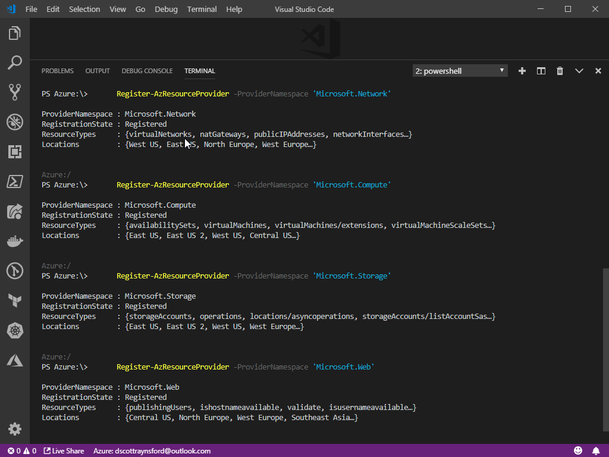
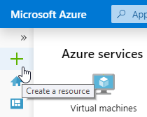
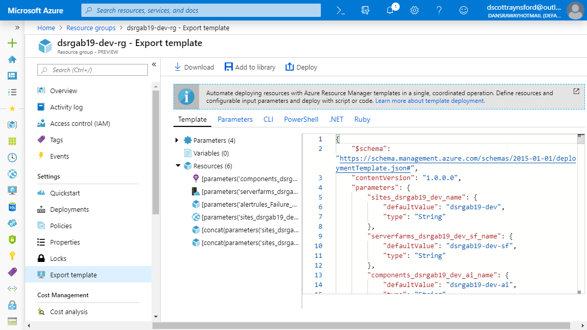
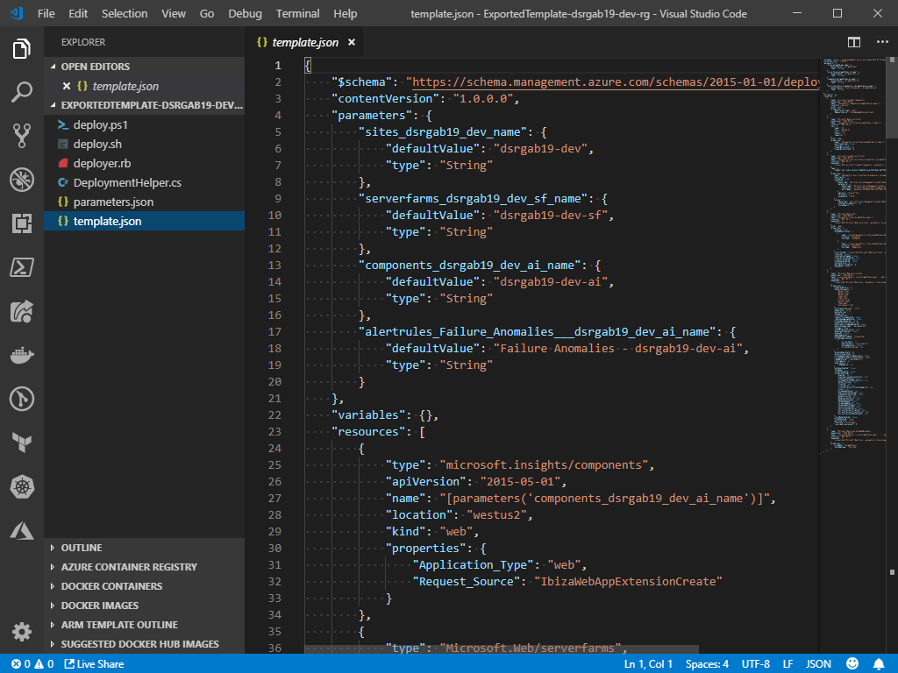

# Using Azure Resource Manager Templates to supercharge your Azure Deployments

Whether you’re a Developer building applications or an IT Pro building virtual data centres in
Azure, at some point you're going to want to use modern Configuration Management practices to
build those services. Azure Resource Manager Templates are the powerful declarative Infrastructure
as Code system that is baked in to Azure. In this session we'll take a look at what Azure Resource
Manager templates are, how to create and edit them and what tricks, tips and tools are available
to you to help you become a Configuration Management master in Azure.

_This workshop was originally created for the Global Azure Bootcamp 2019, but it may be used for
other training sessions or events. It is provided free and under [MIT license](LICENSE)._

**Daniel Scott-Raynsford**


[Microsoft Cloud and Datacenter MVP](https://mvp.microsoft.com/en-us/PublicProfile/5002340?fullName=Daniel%20%20Scott-Raynsford) | [@dscottraynsford](https://twitter.com/dscottraynsford) | [Linked-In](https://www.linkedin.com/in/dscottraynsford/) | [Email](mailto:dscottraynsford@outlook.com) | [GitHub](https://www.github.com/PlagueHO)

## Content

- [Prerequisite Knowledge](#prerequisite-knowledge)
- [What You Will Need](#what-you-will-need)
- [What You Will Learn](#what-you-will-learn)
- [Prerequisite Knowledge](#prerequisite-knowledge)
- [Section 1 - Getting Setup](#section-1---getting-setup)
- [Part 1.1 - Setting up Cloud Shell](#part-1.1---setting-up-cloud-shell) - 5 min
- [Part 1.2 - Configure Visual Studio Code](#part-1.2---configure-visual-studio-code) - 5 min
- [Part 1.3 - Register Providers required for Lab](#part-1.3---register-providers-required-for-lab) - 5 min
- [Section 2 - Creating an ARM Template](#section-2---creating-an-arm-template)
- [Part 2.1 - Create Resources in the Portal](#part-2.1---create-resources-in-the-portal)
- [Part 2.2 - Export an ARM Template](#part-2.2---export-an-arm-template)
- [Part 2.3 - Edit an Exported ARM Template](#part-2.3---edit-an-exported-arm-template)
- [Section 5 - Cleanup After the Workshop](#section-5---cleanup-after-the-workshop)
- [Part 5.1 - Remove Resources and Resource Groups](#part-5.1---remove-resources-and-resource-groups) - 2 min

Estimated workshop time: 75 min
Estimated Azure credit usage: USD 1.00 (as long as you delete the infrastructure straight after completion of the workshop)

## What You Will Need

To complete this workshop you'll need the following:

- A **Microsoft Azure Account**:
  - If you are running this as part of the Global Azure Bootcamp, you will
    have access to a free Azure Pass.
  - You can sign up for a free trial [here](https://azure.microsoft.com/en-us/free/).
- A computer running **Windows**, **OSX** or **Linux** (desktop OS) with
  an **up-to-date version** of either Chrome, Firefox, Edge or Opera.
- **Visual Studio Code**: An extremely powerfull, free open-source editor
  for Windows, Mac and Linux.
  Click [here](https://code.visualstudio.com/) to download it.

## Prerequisite Knowledge

- Basic knowledge of web application hosting on Windows or Linux
- Basic knowledge of text editors (Visual Studio Code)
- Basic knowledge of using text based consoles (PowerShell, Cmd or Bash)

## What You Will Learn

You'll learn the basics in the following skills:

- Create and use the Azure Cloud Shell.
- How to set up Visual Studio Code to edit ARM templates.
- Run some simple PowerShell commands in Cloud Shell.
- What an Azure Resource Manager (ARM) template is and what it is used for.
- How to create basic ARM templates
- How to deploy ARM templates
- How to use Visual Studio Code to edit ARM templates.

## Section 1 - Getting Setup

In this section we'll set up _Azure Cloud Shell_ and _Visual Studio Code_,
so that we're all set to create and deploy ARM templates right from our
desktop.

### Part 1.1 - Setting up Cloud Shell

> Estimated Completion Time: 5 min

Azure Cloud Shell is an interactive, browser-accessible shell for managing
Azure resources. It provides the flexibility of choosing the shell experience
that best suits the way you work. Cloud Shell offers both PowerShell and Bash
console experience and you can flip between them at the touch of a switch.

_Sidenote: the PowerShell experience is actually PowerShell Core running on top
of Bash in a Linux container!_

**In this lab we'll be using the PowerShell experience using the Az PowerShell
modules, but if you're experienced using Bash and the AzCLI, then feel free
to flick across.**

1. Open Cloud Shell by clicking the Cloud Shell icon:
   

> If you have **not** previously used Azure Cloud Shell:

_When you first create a Cloud Shell a storage account will get created
for you to store your settings, scripts and other files you might create.
This enables you to have access to your own environment no matter what
device you're using.
You can customize the storage account settings if you wish, but in this
lab we'll just be using the defaults._


1. Select the **subscription** to create the Storage Account in and click
   **Create storage**.

1. The Storage Account will be created and the Cloud Shell will be started:

   

> Once your Azure Cloud Shell storage has been set up or if you had previous set up Azure Cloud Shell:

1. Select **PowerShell** from the shell drop down:

   

### Part 1.2 - Configure Visual Studio Code

> Estimated Completion Time: 5 min

In this part we will configure Visual Studio Code with the following
extensions:

- [Azure Account](https://marketplace.visualstudio.com/items?itemName=ms-vscode.azure-account):
  The Azure Account extension provides a single Azure sign-in and subscription filtering experience for all other Azure extensions. It makes Azure's Cloud Shell service available in VS Code's integrated terminal.
- [Azure Resource Manager Tools](https://marketplace.visualstudio.com/items?itemName=msazurermtools.azurerm-vscode-tools):
  This extension provides language support for Azure Resource Manager deployment templates and template language expressions.

We will then be configuring Visual Studio Code to be able to connect
to our Azure Cloud Shell.

1. Start Visual Studio Code.
1. Click Extensions.

   

1. Search for the `Azure Account` extension and click **Install**.

   

1. Search for the `Azure Resource Manager Tools` extension and click `Install`.

   

1. Press <kbd>F1</kbd> to bring up the Visual Studio command search.
1. Enter `Cloud Shell` in the command search.
1. Click the **Azure: Open PowerShell in Cloud Shell** command.

   

1. A terminal will open in the Visual Studio Code window requiring you
   to log in to Azure.

   

1. Click Sign In.
1. A browser window will open where you will be asked to sign into your
   Azure account.
1. Sign into the Azure account you created the Cloud Shell in during
   _Step 1.1_.
1. Return to your Visual Studio Code window where you will now have a
   Cloud Shell console ready to accept commands:

   

This console is exactly the same as the Cloud Shell you get in the
[Azure Portal](https://portal.azure.com) or in [shell.azure.com](https://shell.azure.com).

### Part 1.3 - Register Providers required for Lab

> Estimated Completion Time: 5 min

Depending on your type of subscription (Free, Azure Pass etc.) you may have to register the required resource providers.
This is because by default many resource providers (types of resource providers) are not registered by default.

1. Launch a **Cloud Shell** in Visual Studio Code, in the
   [Azure Portal](https://portal.azure.com) or using:

   [](https://shell.azure.com)

1. Depending on your type of subscription (Free, Azure Pass etc.) you may
   have to register the required resource providers. This is because by
   default many resource providers (types of resource providers) are not
   registered by default.

   This only needs to be done once for a subscription. To do this, run
   the following commands in Cloud Shell:

   ```powershell
      Register-AzResourceProvider -ProviderNamespace 'Microsoft.Network'
      Register-AzResourceProvider -ProviderNamespace 'Microsoft.Compute'
      Register-AzResourceProvider -ProviderNamespace 'Microsoft.Storage'
      Register-AzResourceProvider -ProviderNamespace 'Microsoft.Web'
      Register-AzResourceProvider -ProviderNamespace 'Microsoft.SQL'
   ```

   

Your Azure Account and Visual Studio Code is set up to be able to work
with Azure Resource Manager (ARM) Templates more effectively.

**These tools are very useful throughout Azure and should be part of
any Azure professionals toolbox.**

## Section 2 - Creating an ARM Template

In this section we'll create some resources using the [Azure Portal](https://portal.azure.com)
and then export them as a new ARM Template.

### Part 2.1 - Create Resources in the Portal

Create a simple Azure App Service and App Service plan within a
Resource Group to host a simple web application.

> Estimated Completion Time: 7 min

1. Open the [Azure Portal](https://portal.azure.com)
1. Click `Create a Resource`:

   

1. Select `Web` under Azure Marketplace and click `Web App`:

   

1. Set an **App name** to one that will be **Globally Unique**. Suggest
   using your initials appended with `gab19-dev`. E.g. `dsrgab19-dev`.
1. Select `Create new` under **Resource Group** and enter the same name
   as the **App Name** but append '-rg'. For example `dsrgab19-dev-rg`.
1. Set **OS** to `Windows`.
1. Set **Publish** to `Code`.

   

1. Click `App Service Plan/Location` to configure the App Service Plan.
1. Click `Create New`.

   

1. Set **App Service Plan** to the **App Name** prepended with `-sf`. E.g.
   `dsrgab19-dev-sf`.
   This is recommmended as it makes consistency easier when generating the
   template.
1. Set **Location** to `West US 2`.
1. Set **Pricing Tier** to `S1`.

   

1. Click `OK`.
1. Click `Application Insights`.
1. Set **Application Insights** to `Enable`.
1. Select `Create new Resource`.
1. Set **New resource name** to the **App Name** prepended with `-ai`. E.g.
   `dsrgab19-dev-ai`.
   This is recommmended as it makes consistency easier when generating the
   template.
1. Set **Location** to `West US 2`.

   

1. Click `Automation options` to see the exported ARM template that describes
   these resources.
   We are not going to use this template in this lab, but we'll save it anyway
   for reference purposes.
   Instead, we are going to use the template exported at deployment time.

   

1. If you want to store this template for review later, click `Download`.
   We will not be using this template in the Lab.
1. Click the `X` button to close the **Template**.

   

1. Click `Apply`.

   

1. Click `Create`.

Your _App Service_  Web App will be deployed.
It will take a few minutes for the service and supporting resources
to be provisioned.
Once it has been provisioned you can check the _App Service_ is up
by opening your _App Service_ and clicking the `URL`.

   

We'll leave this up to you to determine the best way to locate your
_App Service_.

You should see this page when the App Service has started up:

   

### Part 2.2 - Export an ARM Template

> Estimated Completion Time: 3 min

The next step is to export the resources we created in _Part 2.1_
as a new ARM Template.
You can either export all resources in a Resource Group or a single
resource at a time.
In this lab we will export the entire _Resource Group_ which will
just export all the resources in the Resource Group.

1. Open the [Azure Portal](https://portal.azure.com).
1. Click `Resource Groups` in the Azure Portal.

   

1. Click the Resource Group that was created to contain your App Service
   in _Part 2.1_.
1. Click `Export template`.

   

   It will take a few seconds to generate the ARM Template and other related
   files.

   

   _We could add this template to our Library by clicking `Add to Library`.
   However, because our template really needs some clean up and
   customization, saving it to the Library isn't something we want to do
   now._

1. Click `Download` to download a zip file containing our template.
1. Extract the downloaded zip file to a folder on your computer
   and make a note of the folder as we will use it in the next step.

   

The actual ARM Template is the `template.json` file in the zip file.
The other files are scripts that can be used to deploy the ARM Template
as well as an optional parameters file for the template.

### Part 2.3 - Edit an Exported ARM Template

> Estimated Completion Time: 10 min

Once we've exported a template we typically need to do two things:

- Clean up the template by removing any uneccessary properties.
- Add parameters for any properties we want to set when deploying the
  template.

We will do this by editing the `template.json` file in _Visual Studio
Code_.

1. Open _Visual Studio Code_.
1. Select `Open Folder` from the `File` menu.
1. Select the folder you extracted the files to in _Part 2.2_.
1. Select the `template.json` file:

   

1.

## Section 5 - Cleanup After the Workshop

### Part 5.1 - Remove Resources and Resource Groups

> Estimated Completion Time: 2 min

This step is optional and only needs to be done if you're finished with
workshop resources and want to get rid of them to save some Azure credit.

1. Open the [Azure Portal](https://portal.azure.com).
1. Click `Resource Groups` in the Azure Portal.

   

1. Click the Resource Group that was created to contain your App Service
   in _Part 2.1_.
1. Click `Delete resource group`.

   

1. Enter the name of the Resource Group to confirm you want to delete
   it and Click Delete.


**Well done!**

You have taken your first steps into the powerful world of
deploying and managing Azure resources using ARM templates.
This enables you to deploy and redeploy your Azure resources
in a cost effective, automated, auditable and repeatable way.

If you're keen to learn move from walking to running, how about checking
out how to deploy ARM templates using [Azure DevOps](https://dev.azure.com).

Thank you!
